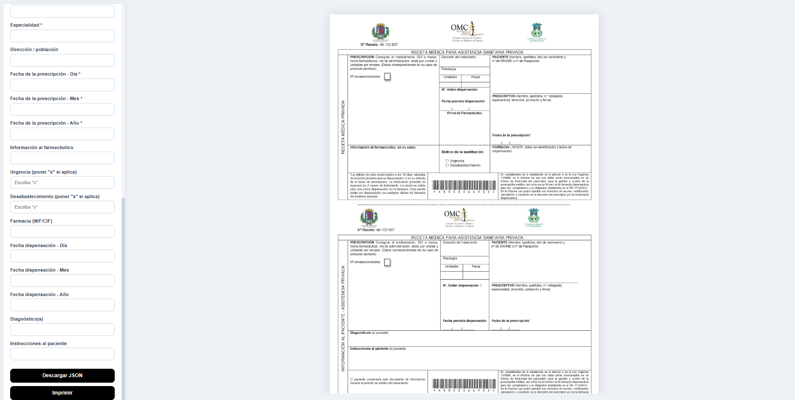

# Medical Prescription Editor

Editor visual de plantillas de recetas médicas desarrollado con React + Vite.

Permite posicionar, mover y personalizar campos dinámicos sobre una plantilla médica real, con vista previa instantánea, validaciones avanzadas, exportación JSON e impresión precisa en formato A4.

---

# Características

## Editor visual interactivo

- Arrastrar campos libremente sobre la plantilla
- Posicionamiento en tiempo real
- Ajuste manual del tamaño de cada campo
- Vista previa instantánea
- Diseño optimizado para impresión A4

---

## Campos médicos completos

Incluye soporte para:

### PRESCRIPCIÓN

- Medicamento
- Nº envases/unidades
- Duración del tratamiento
- Posología
- Unidades
- Pauta
- Nº orden dispensación

### FECHAS

- Fecha prevista de dispensación
- Fecha de la prescripción
- Fecha de dispensación

Cada fecha está separada en:

- Día
- Mes
- Año

---

### PACIENTE

- Nombre y apellidos
- Año de nacimiento
- DNI/NIE/Pasaporte

### PRESCRIPTOR

- Nombre y apellidos
- Nº colegiado
- Especialidad
- Dirección / población

---

### OTROS CAMPOS

- Información al farmacéutico
- Diagnóstico(s)
- Instrucciones al paciente
- Datos de farmacia
- Urgencia
- Desabastecimiento

---

## Vista previa del editor



---

# Validaciones incluidas

## Campos obligatorios

El sistema impide:

- Imprimir
- Descargar JSON

si faltan campos obligatorios.

---

## Validación real de fechas

Las fechas se validan automáticamente:

### Ejemplos inválidos:

- 32/01/2025
- 15/13/2025
- 31/02/2025

Si una fecha no es válida:

- aparece una alerta
- se bloquea la impresión
- se bloquea la descarga JSON

---

## Validación de casillas médicas

Los campos:

- Urgencia
- Desabastecimiento

solo permiten:

- `"x"`
- vacío

En el JSON:

- `"x"` → `true`
- vacío → `false`

---

# Exportación JSON

El editor permite descargar todos los datos introducidos junto con:

- posiciones
- tamaños
- configuración visual

Esto permite:

- guardar recetas
- reutilizar plantillas
- cargar datos desde backend
- persistencia futura en base de datos

---

# Impresión precisa A4

El sistema está optimizado para:

- impresión médica
- formularios oficiales
- plantillas escaneadas

Los campos se imprimen exactamente donde se posicionan visualmente.

---

# Tecnologías usadas

- React
- Vite
- JavaScript (ES6+)
- CSS personalizado
- Layout A4 absoluto

---

# Instalación

## 1. Clonar repositorio

```bash
git clone https://github.com/somilvd/medical-prescription-editor.git
```

---

## 2. Entrar en el proyecto

```bash
cd medical-prescription-editor
```

---

## 3. Instalar dependencias

```bash
npm install
```

---

## 4. Iniciar servidor de desarrollo

```bash
npm run dev
```

---

## 5. Abrir en navegador

```txt
http://localhost:5173
```

---

# Estructura del proyecto

```txt
medical-prescription-editor/
│
├── public/
│   ├── plantilla.jpg
│   └── img/
│       └── vistaPrevia.png
│
├── src/
│   ├── App.jsx
│   ├── index.css
│   └── main.jsx
│
├── index.html
├── package.json
├── vite.config.js
└── README.md
```

---

# 🎯 Uso

## 1. Introducir datos

Rellena los campos desde el panel lateral.

---

## 2. Mover campos

Haz clic y arrastra cualquier campo sobre la plantilla.

---

## 3. Ajustar tamaño

Selecciona un campo y cambia su tamaño desde el panel.

---

## 4. Imprimir

Pulsa:

```txt
Imprimir
```

para generar la receta en tamaño A4 real.

---

## 5. Descargar JSON

Pulsa:

```txt
Descargar JSON
```

para guardar todos los datos y posiciones.

---

# Restricciones incluidas

- Tamaño mínimo y máximo de texto
- Validación de fechas
- Validación de campos obligatorios
- Restricción de casillas tipo "x"
- Bloqueo de impresión con errores

---

# Futuras mejoras

- Guardado automático
- Base de datos
- Login de usuarios
- Carga de plantillas múltiples
- Exportación PDF
- Firma digital
- Backend Node.js / Express
- Persistencia MongoDB/PostgreSQL

---

# Licencia

MIT License

---

# Autor

Desarrollado por:

**somilvd**